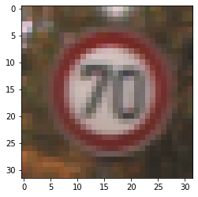

# **Traffic Sign Recognition** 

## Writeup

### by Artem Melnytskyi

---

The goals / steps of this project are the following:
* Load the data set (see below for links to the project data set)
* Explore, summarize and visualize the data set
* Design, train and test a model architecture
* Use the model to make predictions on new images
* Analyze the softmax probabilities of the new images
* Summarize the results with a written report

---

## Files to be submitted checklist:

* Ipython notebook with code [Traffic_Sign_Classifier.ipynb](./Traffic_Sign_Classifier.ipynb)
* HTML output of the code [Traffic_Sign_Classifier.html](./Traffic_Sign_Classifier.html)
* A writeup report [writeup_A_Melnytskyi.md](./writeup_A_Melnytskyi.md)

---

<!-- #region -->

## Dataset Exploration 

### Dataset Summary

I used the pandas library to calculate summary statistics of the traffic

### 1. Data visualization
|                             |                             |                           |
|-----------------------------|-----------------------------|---------------------------|
|   |   | |
|   |   | |
All images have dimention of 31x31x3. 

| Dataset porperty         		| Value   | 
|:-----------------------------:|:-------:| 
| Image data shape              | 32x32x3 |
| Number of classes             |      43 |

### 2. Data classes distribution
 

|	ClassId	|	SignName									|
|---------------|------------------------------------------|
|	1	|	Speed	limit	(30km/h)						|
|	2	|	Speed	limit	(50km/h)						|
|	3	|	Speed	limit	(60km/h)						|
|	4	|	Speed	limit	(70km/h)						|
|	5	|	Speed	limit	(80km/h)						|
|	6	|	End	of	speed	limit	(80km/h)				|
|	7	|	Speed	limit	(100km/h)						|
|	8	|	Speed	limit	(120km/h)						|
|	9	|	No	passing									|
|	10	|	No	passing	for vehicles over 3.5 metric tons				|
|	11	|	Right-of-way	at	the	next	intersection				|
|	12	|	Priority	road								|
|	13	|	Yield										|
|	14	|	Stop										|
|	15	|	No	vehicles								|
|	16	|	Vehicles	over	3.5	metric	tons	prohibited			|
|	17	|	No	entry									|
|	18	|	General	caution									|
|	19	|	Dangerous	curve	to	the	left					|
|	20	|	Dangerous	curve	to	the	right					|
|	21	|	Double	curve									|
|	22	|	Bumpy	road									|
|	23	|	Slippery	road								|
|	24	|	Road	narrows	on	the	right						|
|	25	|	Road	work									|
|	26	|	Traffic	signals									|
|	27	|	Pedestrians									|
|	28	|	Children	crossing							|
|	29	|	Bicycles	crossing							|
|	30	|	Beware	of	ice/snow							|
|	31	|	Wild	animals	crossing							|
|	32	|	End	of	all	speed	and	passing	limits				|
|	33	|	Turn	right	ahead								|
|	34	|	Turn	left	ahead								|
|	35	|	Ahead	only									|
|	36	|	Go	straight	or	right						|
|	37	|	Go	straight	or	left						|
|	38	|	Keep	right									|
|	39	|	Keep	left									|
|	40	|	Roundabout	mandatory							|
|	41	|	End	of	no	passing							|
|	42	|	End	of	no	passing	by	vehicles	over	3.5	metric	|

<b> 1. As we can see data is not normalized by classes distribution! </b> 

<b> 2. Also it is good practice to have fake label like "other", for better handle false-positive cases</b>

### 3. Train / Validation / Test destribution

| Dataset porperty         		| Value   | 
|:-----------------------------:|:-------:| 
| Number of training examples   |   34799 |
| Number of validating examples |    4410 |
| Number of testing examples    |   12630 |

### 4. Data problems 

1. As mentioned before numbers of samples by classes are not balanced

2. Images have 31x31x3 resolutions. That is not usable for real model train (similar to cifar10 dataset)

3. All images have approximately similar perspective

4. All images have approximately similar distance to object 

But this dataset will be used just for test knowledge in creation of NN architecture

### 5. Transform data for train

   #### 5.1 Lets convert labels to vectors.
   
   It will be needed for using BinaryCrossEntropy
    
    

   #### 5.2 General overview of data for train structure 
   
   
   
   #### 5.3 Need to normilize data 
   
   
<!-- #endregion -->

## Design and Test a Model Architecture

<!-- #region -->
### Model Architecture
| Main architecture                 |Inception layer architecture| 
|-----------------------------------|------------------------------------|
| |  |

#### Inception layer 

Inception layers is a state of art aproach in computer vision. 
Inception layer help us :
1. To avoid gradients vanishing gradient problem. 
2. More stability on image scale

To understand the importance of the inception layer’s structure, look at the Hebbian principle from human learning. This says that “neurons that fire together, wire together”.

“(Inception Layer) is a combination of all those layers (namely, 1×1 Convolutional layer, 3×3 Convolutional layer, 5×5 Convolutional layer) with their output filter banks concatenated into a single output vector forming the input of the next stage.”

Links : 
https://en.wikipedia.org/wiki/Vanishing_gradient_problem

https://medium.com/analytics-vidhya/inception-network-and-its-derivatives-e31b14388bf9

### Train model 

I trained model with differend optimizers, and parameters. 

 

 

My choise in this case (data - architecture), is Adam with next params

| param | value |
|-------|-------|
|learning rate| 0.001|
|beta_1 |0.8 |
|beta_2| 0.9|
|epsilon|1e-07|

As loss I use <b>BinaryCrossentropy</b> 

232/232 [==============================] - 4s 16ms/step - loss: 0.0057 - accuracy: 0.9912 - val_loss: 0.0080 - val_accuracy: 0.9814

As result :

| Data                     | acc value|
|--------------------------|-------|
| Best Validation accuracy | 0.983 |
| Test accuracy | 0.965 |
| Best Train accuracy | 0.992 |

395/395 [==============================] - 1s 3ms/step - loss: 0.0118 - accuracy: 0.9654

<!-- #endregion -->

## Test a Model on New Images

<!-- #region -->
Here is cuple of images from google maps (Berlin)

|                                    |                             |                           |
|------------------------------------|-----------------------------|---------------------------|
|   |  ||
||   ||

After :
1. Open image
2. Convert to tensor
3. Resize to input size ( 31x31 , size of images in dataset)
4. Normilize

As can bee seen from provided table model complete sure on signs that have a good representation on train/validate dataset

Model evalution on this 'dataset' give a 100% accuracy:

| Sign name |            Confidence | Predicted class id | actual class id | Image |
|:--------------------:|:----------:|:------------------:|:----------:|-----------|
| Speed limit (30km/h)' | 100.00     | 1                  | 1 | |
| Stop | 100.00 |  14 | 14 |   |
| No vehicles | 100 |  15 | 15 |   |
| Yield | 100 |  13 | 13 |   |
| Priority road | 100.00 | 12 | 12 | |
| raffic signals | 46.00 |  26 | 26 |  |
| No entry|  100.00 | 17 | 17 |  |

<!-- #endregion -->
